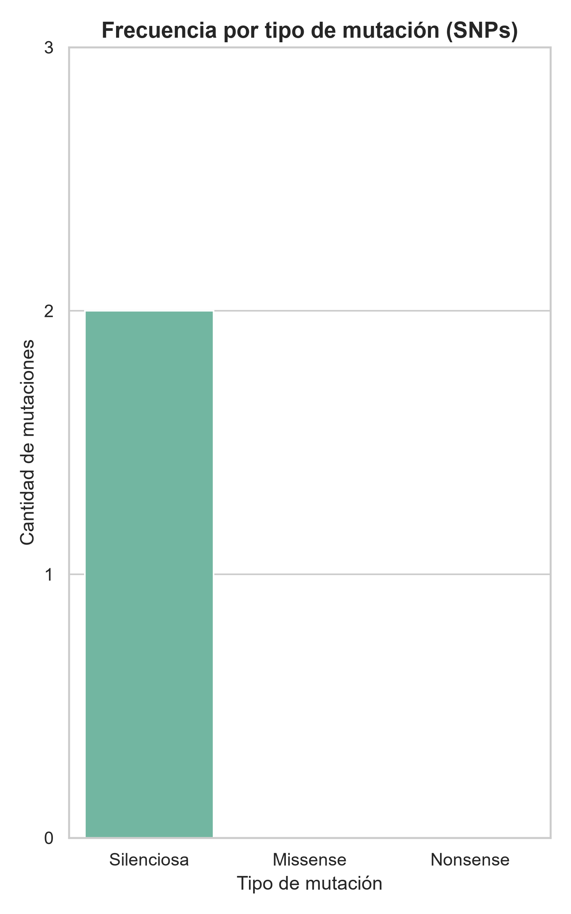

# Analizador de Variantes Genéticas (SNPs)

Pipeline en Python que compara una secuencia de ADN de referencia contra una secuencia de muestra, detecta mutaciones puntuales (SNPs), las clasifica según su efecto biológico, y genera un reporte exportable con visualización.

## Sobre el proyecto

Como biólogo aprendiendo Python, quise construir una herramienta que simule un análisis real de genómica: la detección de variantes es la base de estudios como diagnóstico molecular, resistencia a antibióticos, y seguimiento de mutaciones virales (por ejemplo, variantes de SARS-CoV-2). Este proyecto integra todo lo que fui aprendiendo (funciones, diccionarios, manejo de archivos) junto con librerías estándar de ciencia de datos (pandas, matplotlib, seaborn).

## Funcionalidades

- **Validación**: verifica que ambas secuencias tengan la misma longitud y solo contengan bases válidas (A, T, G, C)
- **Detección de SNPs**: compara ambas secuencias posición por posición e identifica cada diferencia
- **Clasificación de mutaciones**: traduce los codones afectados usando el código genético, y clasifica cada mutación como:
  - **Silenciosa** (no cambia el aminoácido)
  - **Missense** (cambia el aminoácido)
  - **Nonsense** (introduce un codón de parada prematuro)
- **Tasa de mutación**: calcula el porcentaje de la secuencia afectado por mutaciones
- **Reporte exportable**: genera una tabla con pandas y la exporta a CSV
- **Visualización**: gráfico de barras (seaborn) mostrando la frecuencia de cada tipo de mutación

## Cómo usarlo

```python
reporte = generar_reporte_completo(referencia, muestra)
```

Donde `referencia` y `muestra` son dos secuencias de ADN (strings) de la misma longitud.

## Resultado



## Qué aprendí

Este proyecto me permitió practicar funciones modulares que se comunican entre sí (cada una recibe el resultado de la anterior), estructuras de datos anidadas (listas de diccionarios), y el uso de librerías externas de ciencia de datos aplicadas a un problema real de bioinformática.

## Tecnologías

- Python 3
- pandas
- matplotlib
- seaborn

## Notas

El código genético implementado es una versión simplificada con fines educativos. El análisis asume que ambas secuencias están alineadas (misma longitud, sin inserciones/deleciones), por lo que solo detecta sustituciones puntuales (SNPs), no indels.
